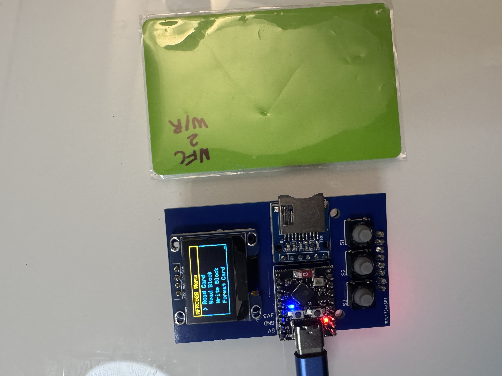
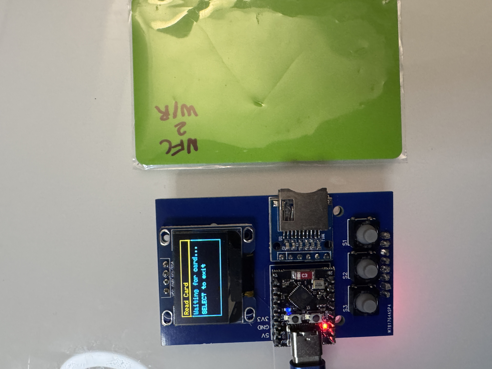
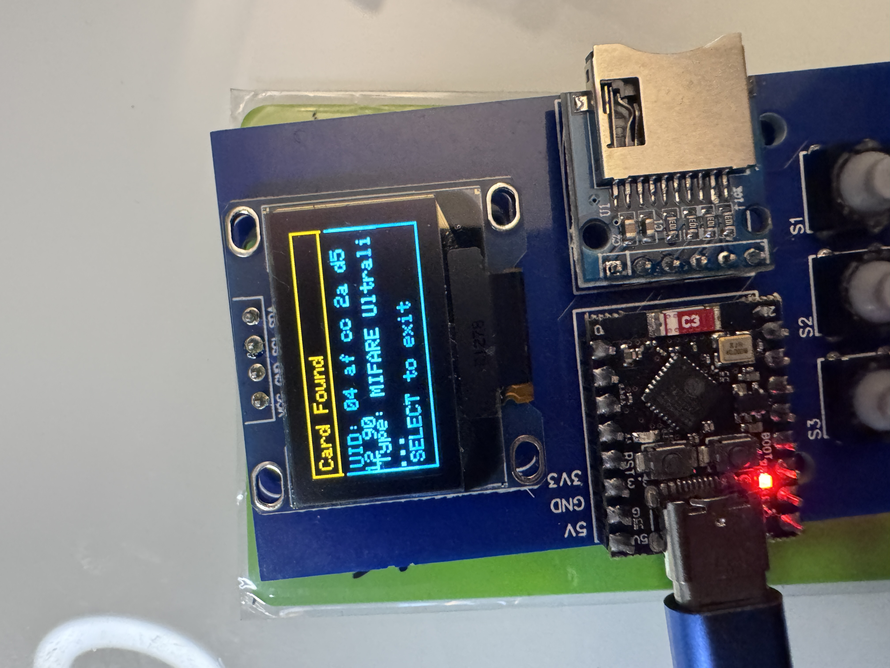
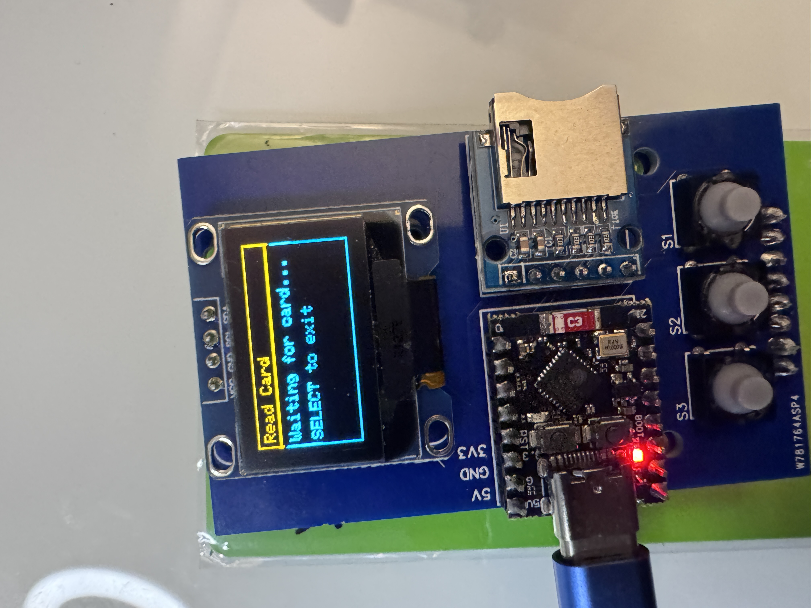
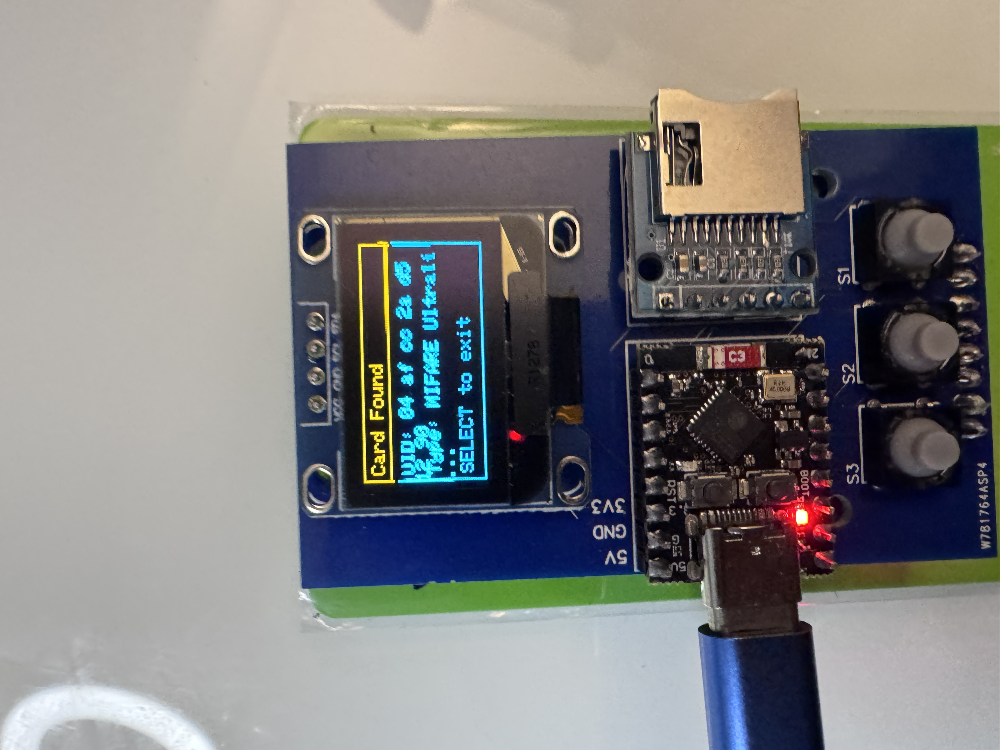
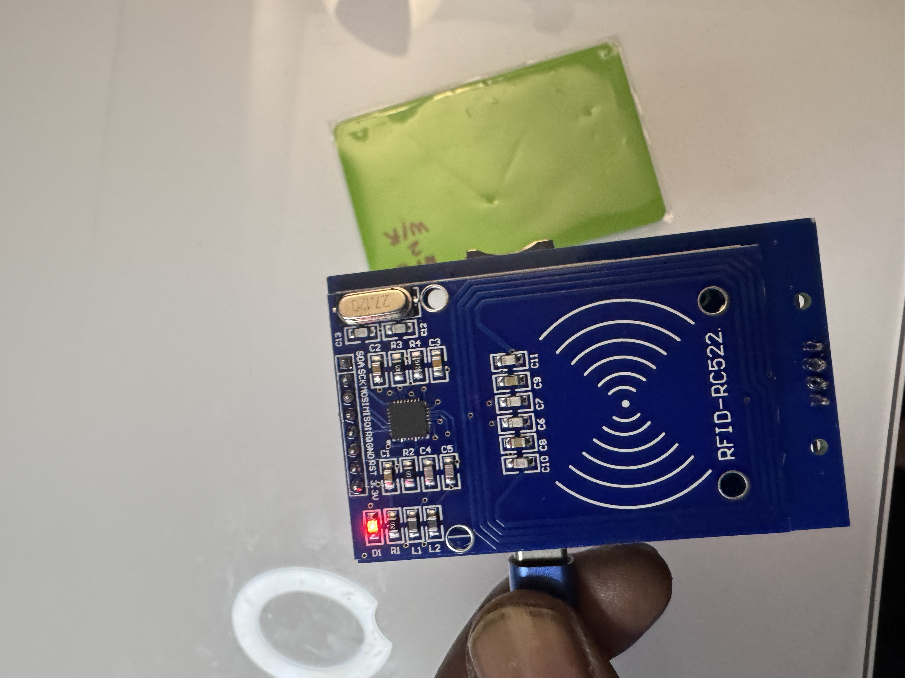
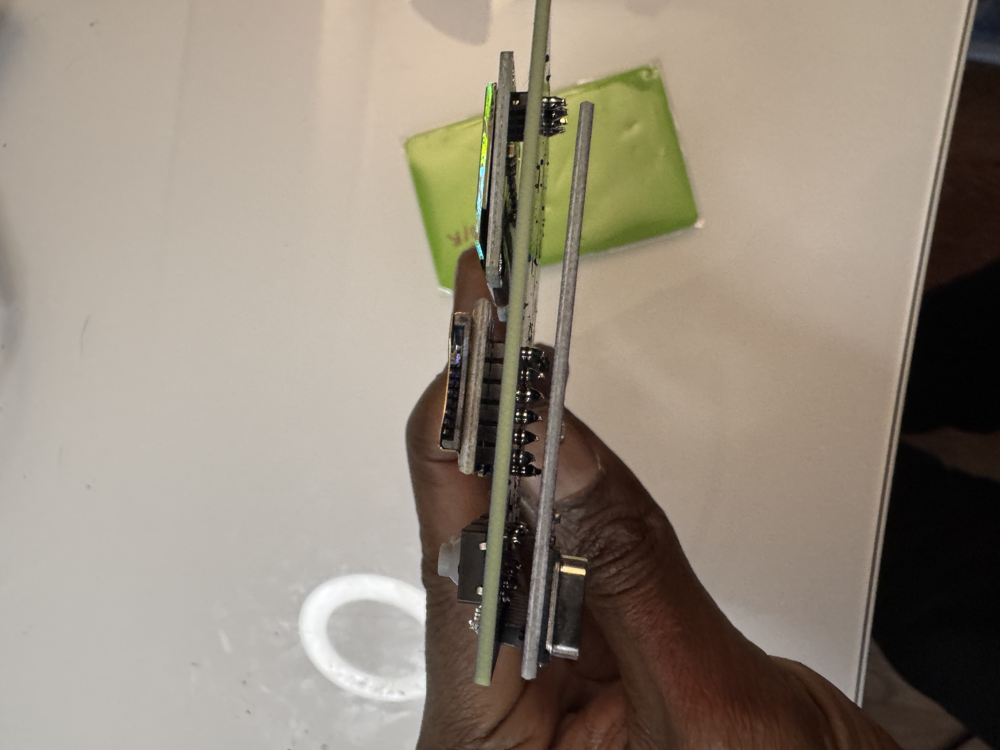
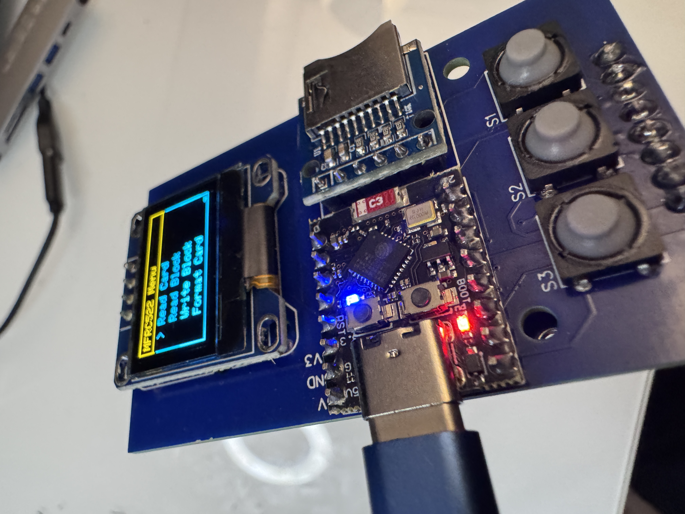

# CYPHER MFRC522
## A tiny ESP32 device that interacts with RFID devices using the MFRC522 chip.

- This project leverages the ESP32-C3 Super Mini microcontroller, featuring a robust setup with an SSD1306 128x64 OLED screen, an SD card module, three input buttons, and a MFRC522 RFID module.
- The schematics and PCB files are available for you to create yourself!
- Get $5 for new users when you make it at PCBWay! https://pcbway.com/g/87Pi52 

## Current Features

- **RFID Functionality**: Read UUID, NDEF messges, erase, and write data using the MFC522 module.
- **User Interface**: Navigate options with three buttons connected to the OLED screen.

## Future Features
- **SD Card Operations**: Seamlessly read, load, and delete files on the SD card.
- **Improve menu flow and button handling***
- **Save scans to SD card** : After reading RFID/NFC, save data to SD Card
- **Write from SD card** : Enter write menu, select SD Card, & choose which data to write. 

More updates will be added soon!

## Parts List

| Component                     | Description                                      |
|-------------------------------|--------------------------------------------------|
| **ESP32-C3 Super Mini**       | Microcontroller with Wi-Fi and Bluetooth support |
| **SSD1306 128x64 OLED Display** | .96-inch screen for displaying information      |
| **SD Card Module**            | Module for reading and writing SD cards         |
| **MFRC522 RFID Module**     | Module for RFID reading and writing         |
| **Push Buttons**              | 3 buttons for user interaction                   |
| **Resistors**                 | 10kΩ resistors for buttons (optional)         |
| **Breadboard**                | For prototyping connections                       |
| **Jumper Wires**              | For making connections between components        |
| **3V Power Supply**              | Suitable power source for the ESP32             |

## Parts used to make this device:
- **ESP32-C3 Super Mini**:
https://amzn.to/3XtgL9G

- **MFC522 RFID Module**:
https://amzn.to/3UHbpXS

- **SSD1306 128x64 Screen**:
https://amzn.to/3TqELJe

- **SD Card Module**:
https://amzn.to/3zsvJot

- **Tactile Buttons**:
https://amzn.to/4gripRD

## Wiring

### SD Card Module

- **CS**: Pin 10
- **MOSI**: Pin 6
- **MISO**: Pin 5
- **SCK**: Pin 4

### Buttons

- **Up**: Pin 3
- **Down**: Pin 1
- **Select**: Pin 2

## Development and Updates

The code is under active development, with regular updates planned to enhance functionality and stability. Keep an eye on this repository for the latest improvements and feature additions.

