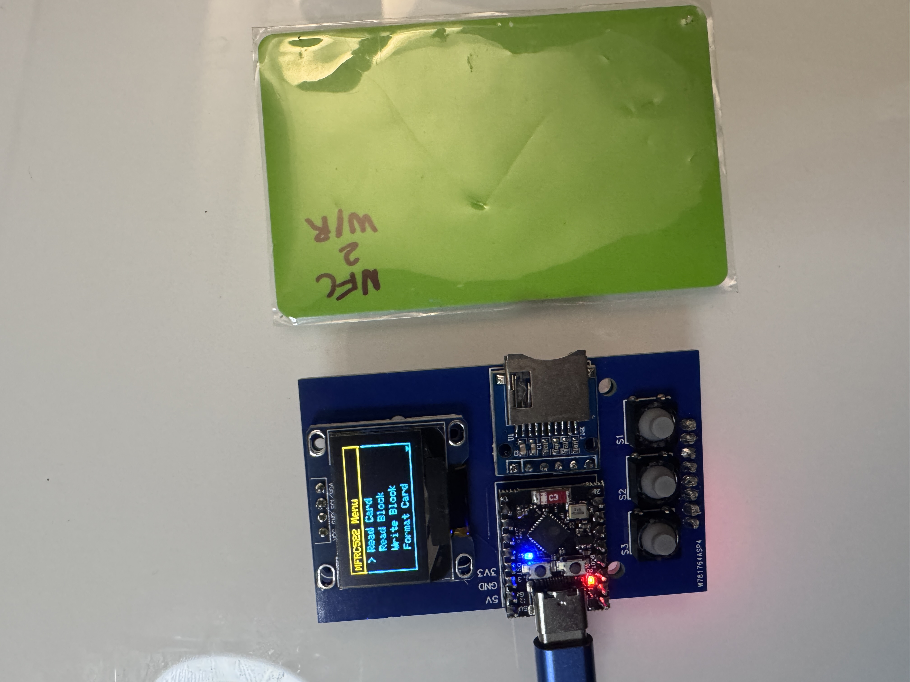
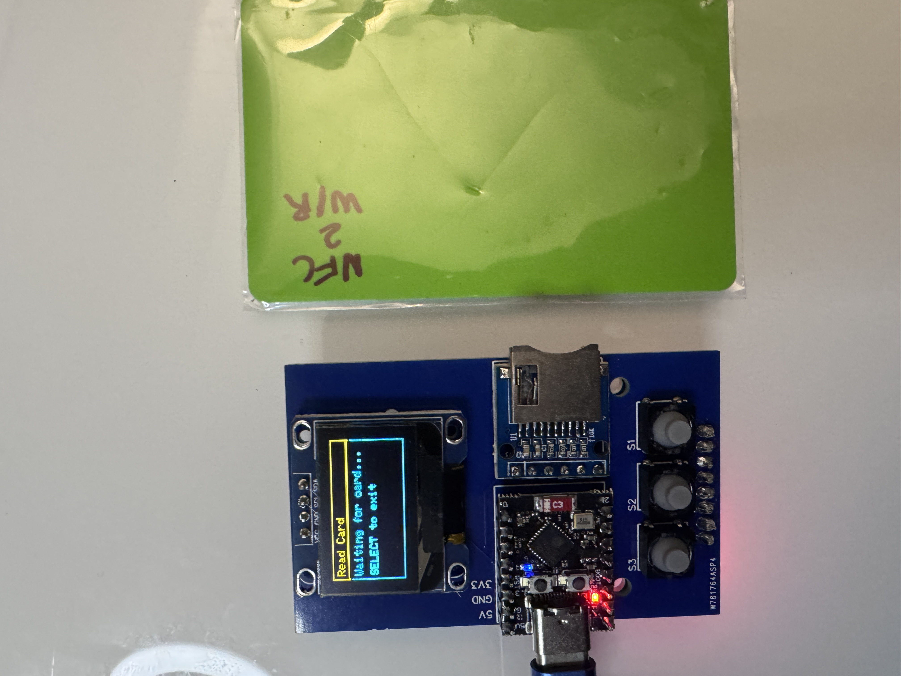
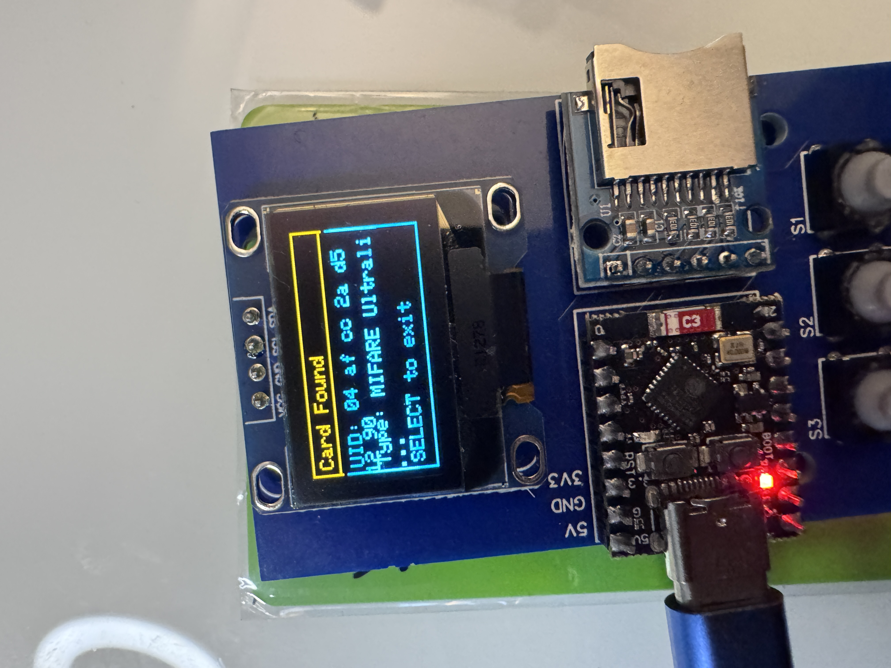
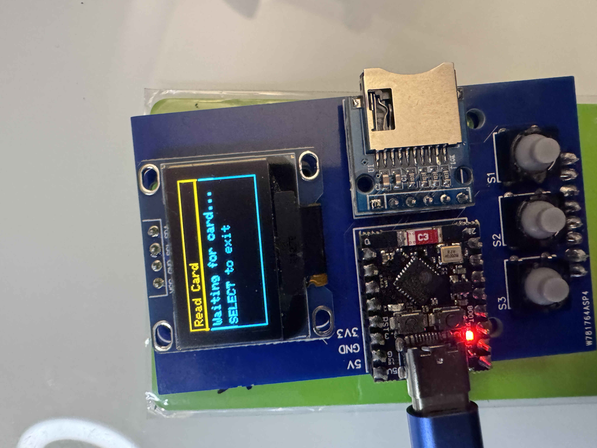
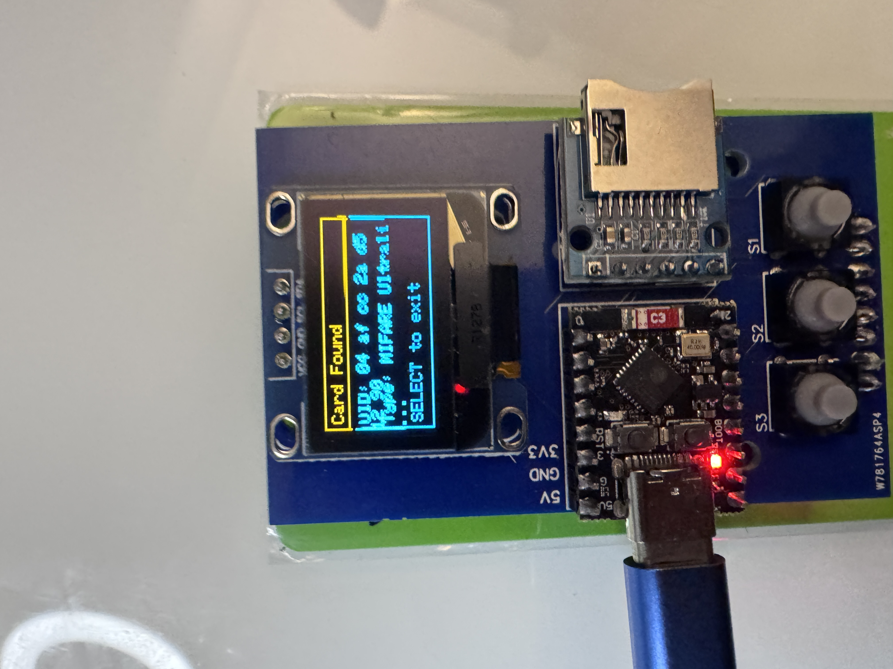
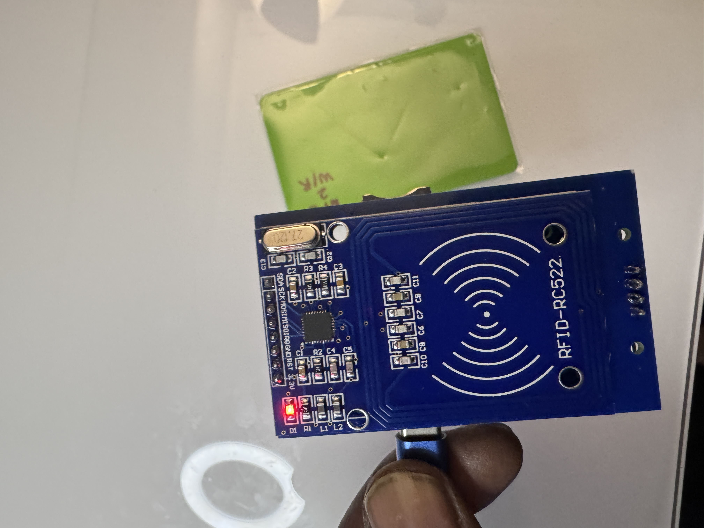
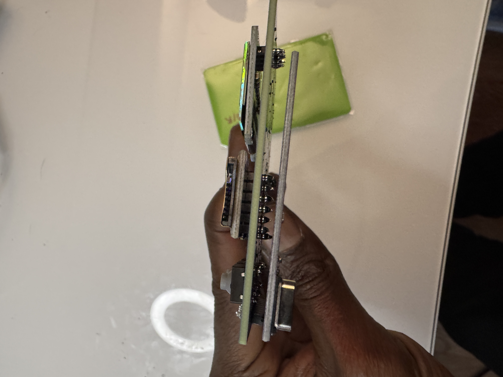
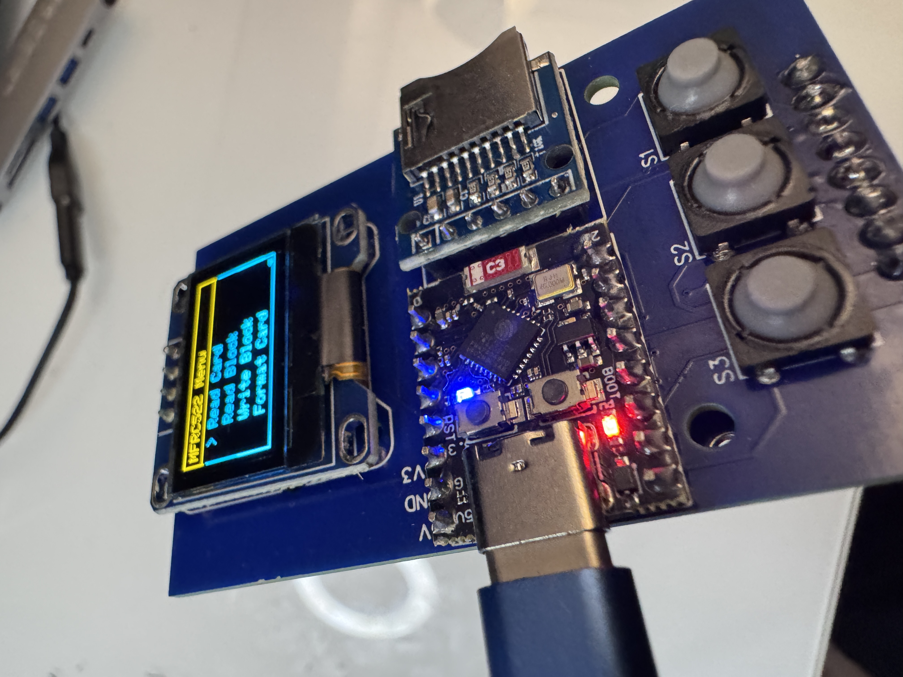

# CYPHER MFRC522

XIAO ESP32C3-based MFRC522 tool focused on MIFARE Classic inspection, authenticated read/write, SD-backed dumps, and explicit magic-card workflows.

## What Changed

- Reworked the sketch into a non-blocking app with a real OLED menu and a serial command surface.
- Added authenticated Classic-sector read/write helpers and a safer dump/restore workflow.
- Added SD-backed dump files, reader diagnostics, and key management scaffolding.
- Normalized the board config to remove the old MFRC522 reset / SD conflict.

## Gallery

<table>
  <tr>
    <td></td>
    <td></td>
    <td></td>
  </tr>
  <tr>
    <td></td>
    <td></td>
    <td></td>
  </tr>
  <tr>
    <td></td>
    <td></td>
    <td></td>
  </tr>
</table>

## New Features

| Feature | How to access |
| --- | --- |
| Card inspection | OLED menu: `Inspect card` or serial: `inspect` |
| UID display | Shown automatically during card inspection |
| Card family detection | Shown in `Inspect card` and `reader info` |
| Authenticated block read | OLED menu: `Read block` or serial: `read-block <n>` |
| Authenticated block write | Serial: `write-block <n> <16 hex bytes>` |
| SD dump save | OLED menu: `Save dump` or serial: `dump save [name]` |
| SD dump restore | OLED menu: `Restore dump` or serial: `dump load <file>` |
| Reader diagnostics | OLED menu: `Diagnostics` or serial: `reader info` / `reader selftest` |
| Key management | Serial: `keys list`, `keys select <index>` |
| Magic-card UID tools | Serial: `magic set-uid <4\|7\|10 hex bytes>` |
| Non-blocking UI | Built into the new menu flow |
| Classic-only gating | Automatic; unsupported cards are rejected clearly |

## Important Limits

- This project is MFRC522-first. It is not a universal NFC stack.
- MIFARE Classic is the primary supported family.
- Ultralight/NTAG/DESFire are not treated as full-featured targets.
- Magic-card UID/backdoor features only work on compatible cards.

## Build

In Arduino IDE select `Tools > Board > ESP32 Arduino > XIAO_ESP32C3`.

Dependencies:
- `MFRC522`
- `Adafruit GFX Library`
- `Adafruit SSD1306`

## Pin Map

| Signal | GPIO |
| --- | --- |
| MFRC522 RST | 21 / D6 |
| MFRC522 SS | 20 / D7 |
| SPI SCK | 8 / D8 |
| SPI MISO | 9 / D9 |
| SPI MOSI | 10 / D10 |
| OLED SDA | 6 / D4 |
| OLED SCL | 7 / D5 |
| SD CS | 2 / D0 |
| Button Up | 3 / D1 |
| Button Down | 4 / D2 |
| Button Select | 5 / D3 |

## Serial Commands

Examples:

```text
help
reader info
reader selftest
inspect
read-block 4
write-block 4 01 02 03 04 05 06 07 08 09 0A 0B 0C 0D 0E 0F 10
dump save
dump load dump_DEADBEEF_123456.dump
keys list
keys select 0
magic set-uid DE AD BE EF
```

## Notes

- Dumps are human-readable text files on the SD card.
- The default key set includes the most common MIFARE Classic defaults.
- The firmware now fails loudly on unsupported card families instead of pretending a transaction succeeded.
- On XIAO ESP32C3, D0 and D9 are boot-related pins; if you see boot issues, move SD CS off D0 and keep D9 only on the SPI bus.
